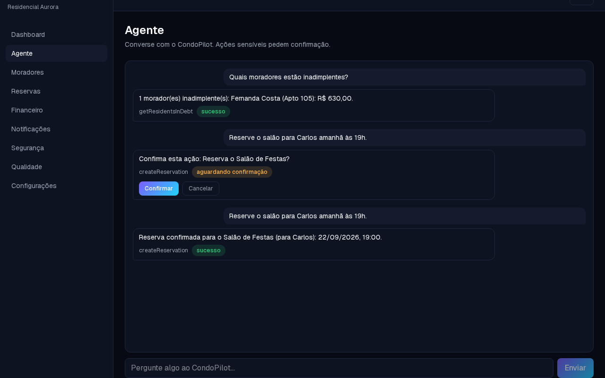
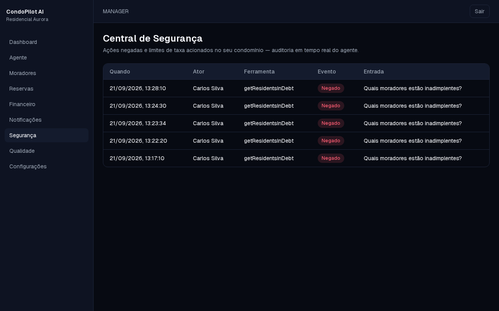

# CondoPilot AI

> An AI agent that doesn't just answer. It acts.

CondoPilot AI is a portfolio-grade demonstration of secure agent engineering applied to condominium operations.

## Goals

- demonstrate Spec-Driven Development;
- demonstrate a real agent/tool architecture;
- demonstrate security and authorization;
- demonstrate full-stack engineering;
- demonstrate observability;
- demonstrate automated testing from unit to E2E;
- produce a polished visual demo suitable for GitHub, LinkedIn and portfolio presentation.

## Core capabilities

- conversational agent;
- resident lookup;
- delinquency lookup;
- reservation availability;
- reservation creation;
- notification simulation;
- execution trace;
- tool-call observability;
- confirmation flows;
- security events;
- seeded demo data.

## Engineering principles

Security-first, test-first where practical, typed boundaries, least privilege, deterministic business rules, observable agent execution and accessible UI.

## Development workflow

This project uses GitHub Spec Kit with Claude Code.

Current Spec Kit documentation describes the production-oriented flow as:

`/speckit-constitution`
`/speckit-specify`
`/speckit-clarify`
`/speckit-plan`
`/speckit-checklist`
`/speckit-tasks`
`/speckit-analyze`
`/speckit-implement`
`/speckit-converge`

Repeat implement/converge until the feature is complete.

## Claude Code

Read `CLAUDE.md` before implementation.

Claude Code is the senior engineering agent for this repository. Human approval remains required for consequential actions.

## Screenshots

| Landing                                     | Agent (both HERO demo phrases)                             | Security Center                               |
| ------------------------------------------- | ---------------------------------------------------------- | --------------------------------------------- |
|  |  |  |

More in `docs/screenshots/`. Automated walkthrough video: `docs/demo-video/demo.webm` (no narration — see
`docs/demo-script.md` for the intended scene-by-scene script).

## Architecture

See `docs/architecture.md` for the diagram and the security boundary it's built around.

## Project status

All eleven roadmap phases (`specs/00-roadmap.md`) are implemented and converged: foundation, agent core,
residents, financial, reservations, notifications, agent playground, security center, quality center, landing,
and this final-demo pass. Both HERO.md demo phrases work end-to-end through the real chat UI. See
`docs/test-report.md`, `docs/security-report.md` and `/quality` (signed in) for what's actually verified versus
what's an open, documented gap.

## Getting started (local, 100% free)

Requirements: Node 22+, Docker.

```bash
docker compose up -d          # Postgres on localhost:55432
cp .env.example .env          # then set AUTH_SECRET (npx auth secret)
npm install
npx prisma migrate dev
npm run db:seed
npm run dev
```

Demo accounts (seeded): `manager@condopilot.demo` / `carlos@condopilot.demo`, password `Demo@123`.

```bash
npm run typecheck
npm run lint
npm run test          # unit + component + integration (needs condopilot_test DB, see below)
npm run test:e2e      # Playwright
```

Integration tests use an isolated database. Create it once with:
`docker exec <postgres-container> psql -U condopilot -d condopilot -c "CREATE DATABASE condopilot_test;"`
then `DATABASE_URL=<TEST_DATABASE_URL from .env.example> npx prisma db push`.

`npm run test:e2e` starts its own build+server on port 3000 and reuses one already there if it finds it — don't
leave a manual `npm run dev`/`npm run start` running on that port while also running E2E locally, or Playwright
will reuse it as-is even after you rebuild, which serves a mismatched `.next` and produces confusing failures.

Other useful scripts: `npm run test:smoke` (the one Smoke-layer spec alone), `npm run docs:screenshots` and
`npm run docs:demo-video` (regenerate the assets under `docs/`, against a server you already have running).

## License

MIT — see `LICENSE`.
