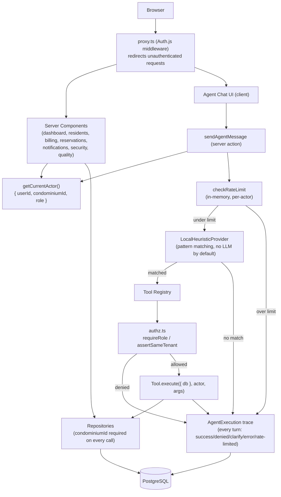

# Architecture

## High-level

Browser
-> Next.js application
-> authenticated API boundary
-> Agent Runtime
-> policy/authorization
-> typed tools
-> application services
-> PostgreSQL

## Diagram (as implemented, R01–R09)

Every arrow into `AuthZ`/`Trace` is enforced server-side — the client never supplies its own tenant, role, or
"already authorized" flag. See `docs/agent-contract.md` for the tool lifecycle and `docs/security.md` for the
threat model this diagram is meant to make legible.

## Agent Runtime

The agent runtime is composed of:

- Context Manager
- Planner/Intent layer
- Policy Engine
- Tool Registry
- Tool Executor
- Result Validator
- Response Composer
- Trace Recorder

### Planner/Intent layer (as implemented)

`getModelProvider()` (`src/agent/providers/index.ts`) picks the planner from `LLM_PROVIDER`:

- `local` (default) — `LocalHeuristicProvider`: deterministic substring matching against fixed
  phrases contributed by each tool. Free, no API key, no network call, immune to prompt injection
  by construction (there's no free-text model in this path).
- `openai-compatible` — `src/agent/providers/openai-compatible.ts`: a real model, via any
  OpenAI-compatible Chat Completions API with tool-calling (tested against Groq's free tier).
  The model receives the same tool registry as JSON Schema and picks one function call — it never
  executes anything itself. Its output (`{ tool, args }`) is handed to the *exact same* pipeline
  as the local provider: schema validation → `requireRole` → confirmation → execution. Swapping
  the provider changes how well natural language is understood; it changes nothing about what's
  authorized to run.
  - The model has no notion of "now" and is unreliable at weekday arithmetic — the prompt is
    built fresh per call with the current date/time and a 14-day date→weekday lookup table
    (`buildUpcomingDaysTable`) so it looks up "segunda-feira" instead of computing it.
  - A planning failure (timeout, bad key, rate limit) is caught in `pipeline.ts` and returned as
    a normal `ERROR` turn — it never surfaces as an unhandled 500.

## Tool principle

The model never receives unrestricted database or infrastructure access.

Example:

`getResidentsInDebt({ condominiumId })`

is preferable to:

`executeSql("SELECT ...")`

## Security boundary

Authentication establishes identity.

Authorization establishes what that identity can do.

Business rules establish whether the requested operation is valid.

The LLM does not replace any of these controls.

## Observability

Every agent execution should have:

- execution ID;
- request ID;
- actor/user ID;
- start/end timestamps;
- model/provider metadata;
- tool calls;
- tool duration;
- success/failure;
- sanitized inputs/outputs;
- error classification.

Do not store secrets or unnecessary sensitive data in traces.

## Failure handling

Agent failures must degrade safely:

- invalid tool arguments -> reject;
- authorization failure -> deny;
- tool timeout -> controlled error;
- database failure -> controlled error;
- model failure -> controlled fallback;
- ambiguous high-impact action -> request clarification/confirmation.
